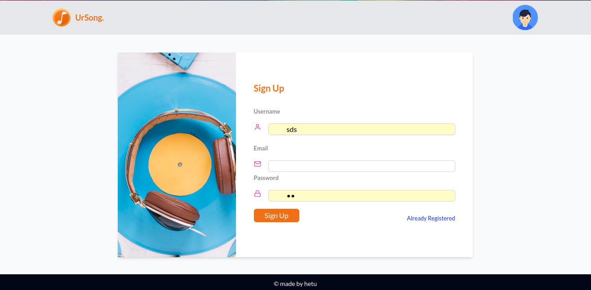
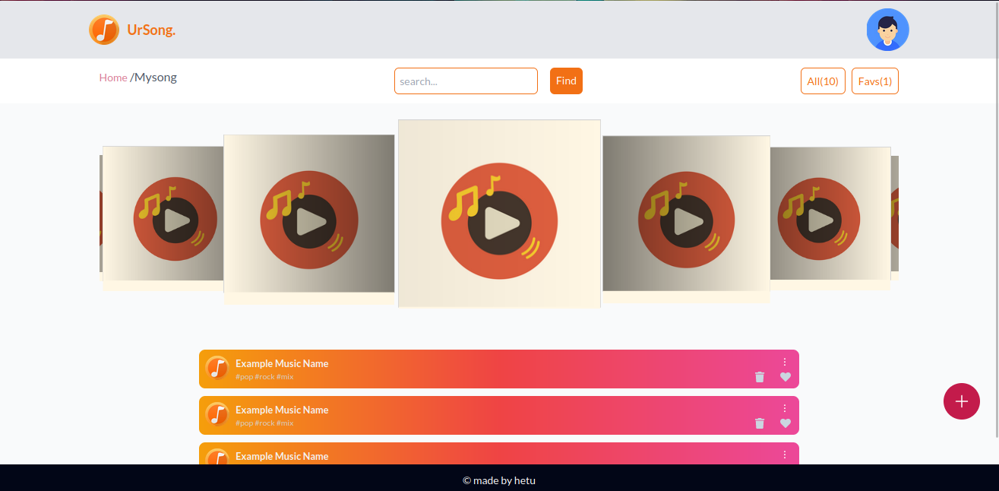

# ursong

 This is a demo project showcasing a music player application built using React, Redux-Saga, React-Redux, SwiperJS, and Styled-Components.

## Screenshots

## Features

- **Playlist Management**: Create, edit, and delete playlists.
- **Dynamic UI**: Beautifully designed user interface using Styled-Components.
- **Smooth Transitions**: Implement smooth transitions between screens and components using SwiperJS.
- **State Management**: Efficient state management using Redux and Redux-Saga.

## Installation

1. Clone this repository.
2. Navigate to the project directory.
3. Run `npm install` to install dependencies.
4. Run `npm start` to start the development server.
5. Open [http://localhost:3000](http://localhost:3000) to view it in the browser.

## Usage

- **Development Mode**: Run `npm start` to start the development server. Changes will automatically reload.
- **Production Build**: Run `npm run build` to create a production build.

## Contributing

Contributions are welcome! Feel free to open issues and pull requests.

## License

This project is licensed under the MIT License - see the [LICENSE](LICENSE) file for details.
